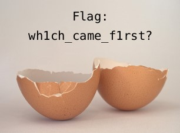

[go back home](/ncs-2021-writeup/)

# BE01

## Briefing

Download the file and find a way to get the flag.

Contents: **chicken.pdf**

## Walkthrough

This challenge starts off with a simple PDF, that just contains an image of a chicken. I tried to select any hidden text by pressing ctrl+a and had no luck. PDF files can contain lots of different objects, so I ran it through `pdf-parser --stats` to list all of the different types of objects: 

```bash
$ pdf-parser chicken.pdf --stats
This program has not been tested with this version of Python (3.9.2)
Should you encounter problems, please use Python version 3.8.7
Comment: 3
XREF: 1
Trailer: 1
StartXref: 1
Indirect object: 10
  6: 1, 3, 6, 7, 9, 10
 /Catalog 1: 5
 /Page 1: 4
 /Pages 1: 2
 /XObject 1: 8

```

As we can see there are a few different objects, but the one that caught my eye was the XObject. Using `pdf-parser -o 8` (as the XObject has an ID of 8), I found out that it was an image, the chicken on the page. I then used `binwalk -e chicken.pdf` to try to extract the image out so I could look at it. To my surprise binwalk detected a few things including a zip achive and some zlib data (which is the image data as PNGs use zlib to store the image), but not the actual image:

```
DECIMAL       HEXADECIMAL     DESCRIPTION
--------------------------------------------------------------------------------
0             0x0             PDF document, version: "1.4"
72            0x48            Zip archive data, at least v1.0 to extract, compressed size: 550522, uncompressed size: 550522, name: egg.zip
550609        0x866D1         End of Zip archive, footer length: 22
551319        0x86997         Zlib compressed data, default compression
6478358       0x62DA16        Zlib compressed data, default compression
6478601       0x62DB09        End of Zip archive, footer length: 22
```


Because of how the PDF stores the image it doesn't include the magic bytes of the image which is what binwalk uses, but it did detect the image data. But since I got a zip file, I no longer cared about the image. Extracting egg.zip results in chicken.zip, which when extracted results in another egg.zip. I extracted that out and calculated an md5 hash of both egg.zip files to confirm they were different. As they had different hashes, I continued extracting in a cycle of egg.zip and chicken.zip files and eventually came to egg.pdf, which when opened contains the following image that contains the flag:

