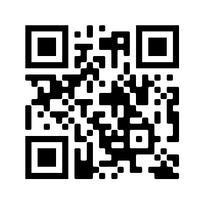

[go back home](/ncs-2021-writeup/)

# CM01

## Briefing

Download the file and find a way to get the flag.

Contents: **code.png**, **frame.png**

## Walkthrough

This challenge has two files, `code.png` and `frame.png`. `frame.png` is a valid QR code:


When scanned it has the following text:

> Hey, I've put the flag into the other file using the same trick we always use.  You know what to do. :)

`code.png` looks like some sort of distorted QR code:


My first thought was that they had to be combined in some way. Combining them through AND would definitely not create a valid QR code as they have some anchor points that are filled in on both images, and combining them through OR (by layering them in GIMP) just created a more distorted code, so I figured I would try using xor. I used G'MIC with the following command to XOR them together:

```bash
$ gmic code.png frame.png -blend xor -o result.png
```

which results in the following image:



which when scanned(I used `zbarimg` but you can also just scan it with your phone) reveals the following text:

> FLAG: A_Code_For_A_Code