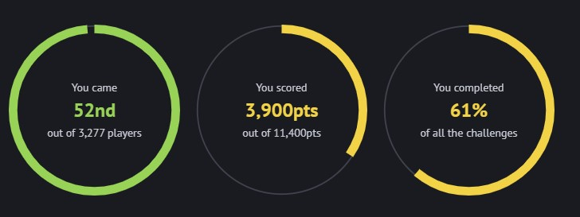

# Home

### Introduction

From April 5th to April 7th I participated in this year's National Cyber Scholarship Competition, a competitive CTF (or Capture-The-Flag) that centers on cybersecurity and ethical hacking. I ended up placing 52nd out of 3,277 high school students who participated:

For my first competitive timed CTF, I think I did pretty well. This website serves to document my approach to the challenges that I completed. Here is a list of challenges I have written walkthroughs for:

### Challenges

| Binary                    | Crypto (WIP)        | Forensics (WIP)        | Networking (WIP)        | Web (WIP)        |
| ------------------------- | ------------------- | ---------------------- | ----------------------- | ---------------- |
| [BE01](binary/be01)       | [CM01](crypto/cm01) | [FE01](forensics/fe01) | [NE01](networking/ne01) | [WE01](web/we01) |
| [BE02](binary/be02)       | [CM02](crypto/cm02) | [FE02](forensics/fe02) | [NM01](networking/nm01) | [WE02](web/we02) |
| [BM01](binary/bh01)       |                     | [FE03](forensics/fe03) |                         | [WM02](web/wm02) |
| [BM02](binary/bm02)       |                     | [FE04](forensics/fe04) |                         | [WM05](web/wm05) |
| [BM03](binary/bm03) (WIP) |                     | [FM01](forensics/fm01) |                         |                  |
| [BH01](binary/bh01)       |                     | [FM02](forensics/fm02) |                         |                  |

## My Setup

For this CTF I used 2 main environments, my main windows desktop and a Kali Linux VM. I ran the VM using WSL2 (Windows Subsystem for Linux) and used [Win-KeX Win](https://www.kali.org/docs/wsl/win-kex-win/) to host the Kali VM GUI in a window instead of running it as a headless server.